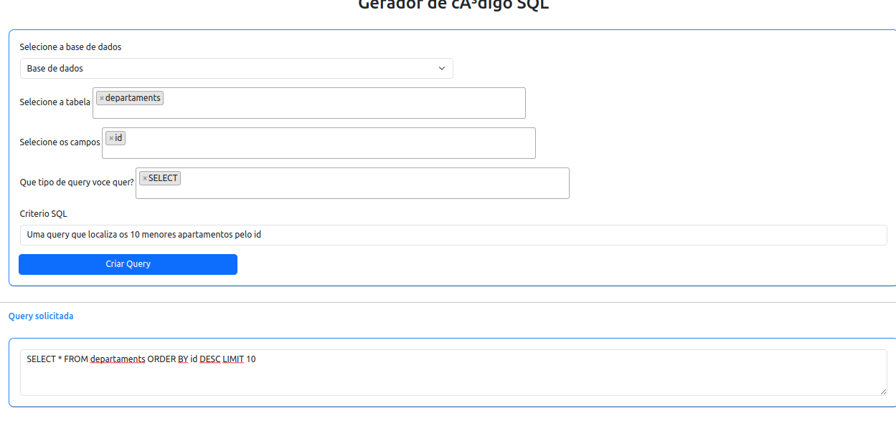

# Gerador SQL com IA

Projeto para apresentação do Hackaton interno da Orizon, nosso projeto tem como objetivo consumir a API da OpenIA gerando querys
inteligentes baseadas em critérios que solicitamos.

O projeto é desenvolvido com springboot java, javascript, css e html.

1 - Para testar clone o repositório e no código java adicione a chave para consumir a API da OpenAI.
 ### Criar sua chave: https://platform.openai.com/account/api-keys

2 - Rode a aplicação e execute o index.html disponível na pasta resources/static...

# Participantes:

<table>
<tbody>
<tr>

<td align="center">
<a href="https://github.com/fariawillyan">

 

<b>Willyan Faria</b>

</a>
 

<a href="https://github.com/Fariawillyan/GeradorSqlIa">
</td>

<td align="center">
<a href="https://github.com/1992-leonardo">

 

<b>Leonardo Possan</b>

</a>
 

<a href="https://github.com/Fariawillyan/GeradorSqlIa">
</td>

<td align="center">
<a href="https://github.com/WilsonBoituva">

 

<b>Wilson Silva</b>

</a>
 

<a href="https://github.com/Fariawillyan/GeradorSqlIa">
</td>

<td align="center">
<a href="https://github.com/anbernal">

 

<b>Anderson Bernal </b>

</a>
 

<a href="https://github.com/Fariawillyan/GeradorSqlIa">
</td>

</tr>
</tbody>
</table>

